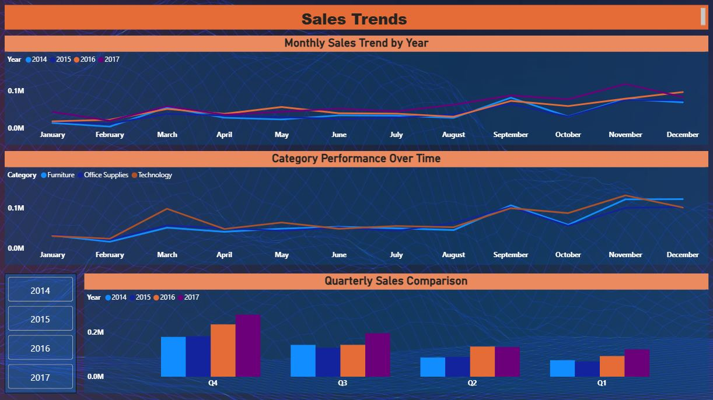
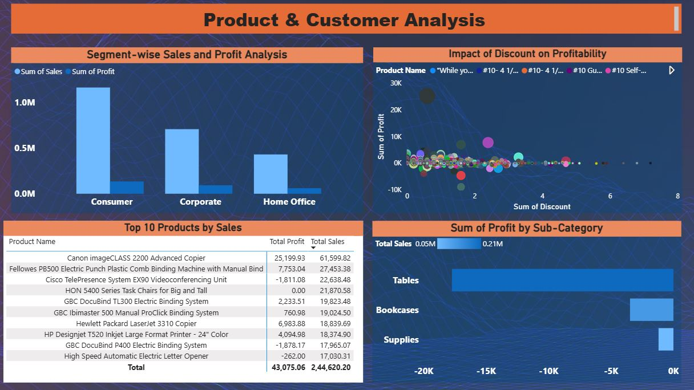

# retail-sales-analytics
End-to-end Retail Sales Analytics &amp; ML Forecasting project using Python, SQL, Excel &amp; Power BI

## 📌 Project Overview
End-to-end data analytics + ML project analyzing 4 years of retail
sales data to identify trends, build KPI dashboards, and predict
future sales using Random Forest and XGBoost models.

## 🎯 Business Objective
- Identify top-performing and loss-making products/regions
- Track sales trends and seasonality patterns
- Predict next month's sales to enable better inventory planning

## 🛠️ Tools & Technologies
| Tool | Purpose |
|------|---------|
| Python (Pandas, Seaborn) | Data Cleaning & EDA |
| SQL (SQLite) | Business Queries |
| Advanced Excel | Initial Analysis & Pivots |
| Power BI | Interactive Dashboard |
| Scikit-learn, XGBoost | ML Forecasting |
| GitHub | Version Control |

## 📊 Key Insights
- Technology category generates highest revenue (36% of total sales)
- Tables and Bookcases sub-categories are consistently loss-making
- West region outperforms all others; South has highest growth potential
- High discounts (>40%) strongly correlate with negative profit
- XGBoost model achieved R² = 0.91 in sales forecasting

## 📁 Project Structure
retail-sales-analytics/
├── data/
├── notebooks/
├── sql/
├── excel/
├── powerbi/
└── reports/

## 🚀 How to Run
1. Clone repo: git clone https://github.com/namratabanerjee1998-arch/retail-sales-analytics
2. Download dataset from Kaggle (link above) → place in data/raw/
3. Install dependencies: pip install -r requirements.txt
4. Run notebooks in order: 01 → 02 → 03
5. Open powerbi/retail_dashboard.pbix in Power BI Desktop

## 📸 Dashboard Preview
## 📸 Dashboard Preview

### 📊 Page 1: Sales Overview

### 📊 Page 2: Customer Analysis

### 📊 Page 3: Product Performance

### 📊 Page 4: Regional Insights

